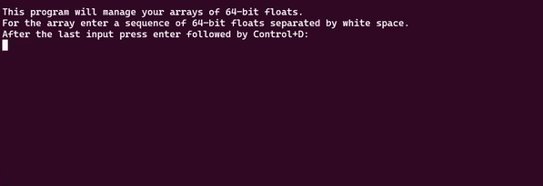
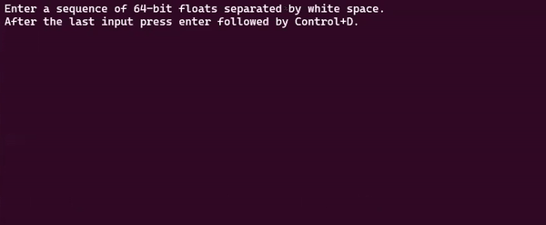

# An x86-64 Assembly Function Library
### This repository contains various different functions written in x86-64.

## input_array.asm
This function prompts the user for a sequence of floats and returns a populated array AND its size separately.

Prototype: `long input_array(double *W, long max)` \
Assemble: `nasm -f elf64 -l input_array.lis -o input_array.o input_array.asm`

The function is called with a maximum size integer and a pointer to the address of the array to be populated. A sequence of floats is entered by the user and each is placed into a consecutive cell of an array. The loop terminates on `<enter> <ctrl+d>` or upon reaching (long max) elements. The number of elements entered is also returned. Input validation is implemented to retry upon encountering an int or string.

This program utilizes the third-party function `isfloat.asm` for input validation. \
[Documentation and Download Here](https://sites.google.com/a/fullerton.edu/activeprofessor/4-subjects/x86-programming/library-software/isfloat-x86-only?authuser=0)

## harmonic_sum.asm
This function returns the harmonic sum of all floats in the given array. \
Prototype: `double harmonic_sum(double arr[], int arr_size)` \
Assemble: `nasm -f elf64 -l harmonic_sum.lis -o harmonic_sum.o harmonic_sum.asm`

## compute_mean.asm
This function returns the mean of all floats in the given array. \
Prototype: `double compute_mean(double arr[], int arr_size)` \
Assemble: `nasm -f elf64 -l compute_mean.lis -o compute_mean.o compute_mean.asm`

The mean is computed by iterating through the given array and maintaining a running sum of the values. Upon reaching the end of the array, sum is divided size and the mean is returned.